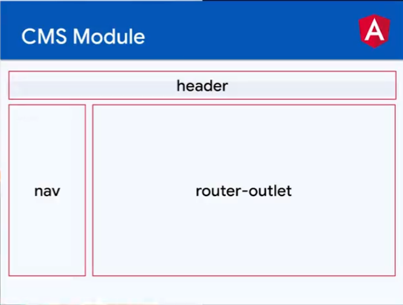

# CURSO DE ANGULAR 04: ANGULAR ROUTER

https://platzi.com/clases/2487-angular-modular/41183-bienvenida/
# LINK TO GITHUB PROJECT

  https://github.com/JUANLUNABLANCO/curso-angular-router

## CREATED BY

Juan Manuel Luna Blanco
[Instagram: gotth3way](https://www.instagram.com/gotth3way.apis/)
[Instagram: Kryptonite](https://www.instagram.com/kryptonite.original/)

[Linkedin](https://www.linkedin.com/in/juan-manuel-luna-blanco-180a1570/)

[Youtube: desarrolladorhoy](https://www.youtube.com/channel/UCSEwIRkDJxLkbvKHOAcw_Xw)
[Youtube: Kryptonite](https://www.youtube.com/channel/UCSEwIRkDJxLkbvKHOAcw_Xw)

## INSTALACIONES

> node -v                 // v16.17.0
> npm -v                  // 8.15.0
> npm i -g @angular/cli
> ng version              // 16.17.0

## CREAR UN PROYECTO CON EL CLI DE ANGULAR

> ng new my-store-app-api
> cd my-store-app-api
> ng serve

visit (http://localhost:4200)

## SOME THINGS OF THIS CLI

### MyStoreWithAngular

This project was generated with [Angular CLI](https://github.com/angular/angular-cli) version 15.0.4.

### Development server

Run `ng serve` for a dev server. Navigate to `http://localhost:4200/`. The application will automatically reload if you change any of the source files.

### Code scaffolding

Run `ng generate component component-name` to generate a new component. You can also use `ng generate directive|pipe|service|class|guard|interface|enum|module`.

### Build

Run `ng build` to build the project. The build artifacts will be stored in the `dist/` directory.

### Running unit tests

Run `ng test` to execute the unit tests via [Karma](https://karma-runner.github.io).

### Running end-to-end tests

Run `ng e2e` to execute the end-to-end tests via a platform of your choice. To use this command, you need to first add a package that implements end-to-end testing capabilities.

### Further help

To get more help on the Angular CLI use `ng help` or go check out the [Angular CLI Overview and Command Reference](https://angular.io/cli) page.


## Arrancar el servidor de desarrollo

> ng serve -o                 // servir el proyecto
> ng serve -o --port=3500     //  en el puerto especificado
> ng version

```
     _                      _                 ____ _     ___
    / \   _ __   __ _ _   _| | __ _ _ __     / ___| |   |_ _|
   / △ \ | '_ \ / _` | | | | |/ _` | '__|   | |   | |    | |
  / ___ \| | | | (_| | |_| | | (_| | |      | |___| |___ | |
 /_/   \_\_| |_|\__, |\__,_|_|\__,_|_|       \____|_____|___|
                |___/
```

Angular CLI: 15.0.4
Node: 16.17.0
Package Manager: npm 8.15.0
OS: win32 x64
Angular: 15.0.4

... animations, cli, common, compiler, compiler-cli, core, forms
... platform-browser, platform-browser-dynamic, router

Package                         Version
---------------------------------------------------------
@angular-devkit/architect       0.1500.4
@angular-devkit/build-angular   15.0.4
@angular-devkit/core            15.0.4
@angular-devkit/schematics      15.0.4
@schematics/angular             15.0.4
rxjs                            7.5.7
typescript                      4.8.4

## Archivos importantes de Configuración

### archivos de configuración de typescript y angular

tsconfig.json
tsconfig.app.json
tsconfig.spec.json


### browser listado de compatibilidades

.browserlistrc


### editor

.editorconfig


### angular

angular.json


### testing

karma.conf.json


### Node version manager

.nvmrc

### Extensiones de VSC

Angular language Service
editor config
eslint

## Linter para el proyecto

> npm install eslint --save-dev   // lo instala

## ESLINT EXTENSION

The extension uses the ESLint library installed in the opened workspace folder. If the folder doesn't provide one the extension looks for a global install version. If you haven't installed ESLint either locally or globally do so by running <b>npm install eslint</b> in the workspace folder for a local install or npm install -g eslint for a global install.

On new folders you might also need to create a .eslintrc configuration file. You can do this by either using the VS Code command Create ESLint configuration or by running the eslint command in a terminal. If you have installed ESLint globally (see above) then run

> eslint --init

in a terminal. If you have installed ESLint locally then run

> .\node_modules\.bin\eslint --init

under Windows and ./node_modules/.bin/eslint --init under Linux and Mac.

## Aplicar un Linter (buenas prácticas de angular)

> ng lint // comando para revisar el código, sino hay ningún linter, nos informa de los linters disponibles en angular

Instalaremos este

> ng add @angular-eslint/schematics

Y ahora si podemos ejecutar el comando anterior
> ng lint // ahora analizará el código en busca de errores

al ejecutarlo nos muestra los errores y malas practicas, hay algunos que no se pueden evitar, deberíamos poder deshabilitar el error o el warning de alguna manera

También puedes modificar e implementar tus propias reglas de codificación editando el archivo .eslintrc.json que fue creado en la raíz del proyecto.


## SOME PROBLEMS WITH TSCONFIG

If you receive this problem for the linter in some files:

  parsing error: Cannot read file 'tsconfig.json'

That is because, the linter cannot find this tsconfig.json

Do that:

 .eslintrc.json 
```
        "project": [
          "tsconfig.json"
        ],

        cambia esa línea por la siguiente

        "project": [
          "**/tsconfig.json"
        ],
``` 

## SOME PROBLEMS WITH .eslintrc.json

if you recibe this problem in the .eslintrc.json:

  "No inputs where found in config file"

You can change that in this file:

 .eslintrc.json 
```
{
  "compilerOptions": {
    "moduleResolution": "node"
  }
}
``` 

 to

 .eslintrc.json
```
{
  "compilerOptions": {
    "moduleResolution": "node"
  },
  "include": [
    "./src/**/*.ts"
  ]
}
```


## GIT CONFIGURATIONS

git init
git config --local user.email "desarrolloaplicacionesweb.jmlb@gmail.com"
git config --local user.name "JUANLUNABLANCO"
git branch -M  main

	En este punto debes crear un repositorio nuevo en github vac铆o y enlazarlo

	<!-- > git remote add origin https://github.com/JUANLUNABLANCO/<tu-repo>.git -->
	> git remote add origin https://github.com/JUANLUNABLANCO/curso-angular-router.git
	> git config --list
	> git add .
	> git commit -m "scaffolding project with webpack"
	> git push -u origin main

## PROBLEMAS CON EL EOL EN W10

> git config --global core.autocrlf true

pondrá todos los ficheros que tengan un salto de línea en \r\n, que es lo que necesita windows, en vez de
\n que es lo que necesita los sistemas unix

con eso, en el README.md podrás leerlo como se espera

tras esa configuración y para que surta efecto debes de hacer lo siguiente

> git add --renormalize .

> git commit -m "Renormalizing eofile eolines"

> git push origin main

// IMPORTANTE el codigo de los ficheros debe ser copiado directamente en el README.md entre 
``` comillas ``` para que se vea bien, porque por defecto un fichero de código borra los eol.


## Extensiones del navegador

	JSON Formatter
	Angular dev tools << DEPENDIENDO DEL TIPO DE TECNOLOGÍA HABRÁ UNA U OTRA >>

## Cliente APIS
	### apps externas
	
		Insomnia.rest << DEPENDIENDO DEL TIPO DE TECNOLOGÍA HABRÁ UNA U OTRA >>
		Postman

	### extension de VSC

		Thunder client << DEPENDIENDO DEL TIPO DE TECNOLOGÍA HABRÁ UNA U OTRA >>

## npm aditional installations

	> npm install date-fns --save << DEPENDIENDO DEL TIPO DE TECNOLOGÍA HABRÁ UNA U OTRA >>


## CREANDO RUTAS [vídeo-2]

páginas a crear, para las routes: Se crean como componentes pero se meten en la carpeta pages porque serán componentes de tipo routes.

ng g c pages/home
ng g c pages/notFound
ng g c pages/category
ng g c pages/mycart
ng g c pages/login
ng g c pages/register
ng g c pages/recovery
ng g c pages/profile


Ahora con router-oulet manejaremos rutas y no renderizaremos nuestro app-products directamente el router-outlet se encargará.

 app.component.html
```
<app-nav></app-nav>
<router-outlet></router-outlet>
<!-- <app-products></app-products> -->
```

Automáticamente el cli de angular añade por cada componente lo siguiente en el app.module.ts

 app.module.ts
```
  ...
  import { NotFoundComponent } from './pages/not-found/not-found.component';
  import { CategoryComponent } from './pages/category/category.component';
  import { MyCartComponent } from './pages/my-cart/my-cart.component';
  import { LoginComponent } from './pages/login/login.component';
  import { RegisterComponent } from './pages/register/register.component';
  import { RecoveryComponent } from './pages/recovery/recovery.component';
  import { ProfileComponent } from './pages/profile/profile.component';

  @NgModule({
    declarations: [
      ...
      HomeComponent,
      NotFoundComponent,
      CategoryComponent,
      MyCartComponent,
      LoginComponent,
      RegisterComponent,
      RecoveryComponent,
      ProfileComponent
      ],
```

Para crear el routing con esas páginas tenemos que importarlas en app.routing.ts

 app.routing.ts
```
import { HomeComponent } from './pages/home/home.component';
import { NotFoundComponent } from './pages/not-found/not-found.component';
import { CategoryComponent } from './pages/category/category.component';
import { MyCartComponent } from './pages/my-cart/my-cart.component';
import { LoginComponent } from './pages/login/login.component';
import { RegisterComponent } from './pages/register/register.component';
import { RecoveryComponent } from './pages/recovery/recovery.component';
import { ProfileComponent } from './pages/profile/profile.component';

const route: Routes = [
  {
    path: 'home',
    component: HomeComponent
  },
  {
    path: 'category',
    component: CategoryComponent
  },
  {
    path: 'my-cart',
    component: MyCartComponent,
  },
  {
    path: 'login',
    component: LoginComponent,
  },
  {
    path: 'register',
    component: RegisterComponent,
  },
  {
    path: 'recovery',
    component: RecoveryComponent,
  }
];

@NgModule({
  imports: [RouterModule.forRoot(routes)],
  exports: [RouterModule]
})
export class AppRoutingModule { }
```

Ahora el router outlet no muestra nada, porque no tenemos una ruta por defecto que nos lleve al home por ejemplo, pero si pones: localhost://home podrás ver el home y así con cada ruta definida.


## Creando el Home (comunicación padre hijo | @Input) [vídeo-3]

ahora en el componente home

 home.component.html
```
<app-products></app-products>
```

y si vamos a http://localhost:4200/home

veremos los productos renderizados, como los teníamos antes.

Para que renderice el home por defecto podemos hacer lo siguiente

 app-routing.module.ts
```
  ...
  {
    path: '',
    redirectTo: '/home',
    pathMatch: 'full'
  },
  {
    path: 'home',
    component: HomeComponent
  },
  ...
```

Vamos a hacer unos cambios en el products.component.ts para que nos sirva para las categorías, para ello icluiremos un Input y algunas cosas

 Estado actual del products.component.ts
```
import { Component, OnInit } from '@angular/core';

import { Product, CreateProductDTO, UpdateProductDTO } from '../../models/product.model';

import { StoreService } from '../../services/store.service';
import { ProductsService } from '../../services/products.service';

@Component({
  selector: 'app-products',
  templateUrl: './products.component.html',
  styleUrls: ['./products.component.scss']
})

export class ProductsComponent implements OnInit {

  myShoppingCart: Product[] = [];
  total = 0;
  products: Product[] = [];
  showProductDetail = false;
  productChosen: Product = {
    id: '',
    price: 0,
    images: [],
    title: '',
    category: {
      id: '',
      name: '',
    },
    description: ''
};

  // pagination
  limit=10;
  offset=0;
  page=0;
  MAX_PRODUCTS_IN_BD = 50;  // esto debería consultarse a productService

  // statusDetail
  statusDetail: 'loading' | 'success' | 'error' | 'init' = 'init';

  constructor(
    private storeService: StoreService,
    private productsService: ProductsService
  ) {
    this.myShoppingCart = this.storeService.getShoppingCart();
  }
  
  ngOnInit(): void {
    // this.productsService.getAllProducts()  // SIN PAGINATION
    // .subscribe(data => {
      //   this.products = data;
    // });
    this.productsService.getProductsByPage(this.limit, this.offset)
    .subscribe(data => {
      this.products = data;
    });
  }
  
  pageUp(){
    if (this.limit * (this.page + 1) < this.MAX_PRODUCTS_IN_BD ) {
      this.page += 1;
      this.offset = this.limit * this.page;
      this.productsService.getProductsByPage(this.limit, this.offset)
        .subscribe(data => {
          this.products = data;
      });
    }
  }
  
  pageDown(){
    if ((this.page - 1) >= 0 ) {
      this.page -= 1;
      this.offset = this.limit * this.page;
      this.productsService.getProductsByPage(this.limit, this.offset)
        .subscribe(data => {
          this.products = data;
      });
    }
  }

  onAddToShoppingCart(product: Product) {
    this.storeService.addProduct(product);
    this.total = this.storeService.getTotal();
  }
  toggleProductDetail() {
    this.showProductDetail = !this.showProductDetail;
  }
  onShowDetailProduct(id: string) {
    this.statusDetail = 'loading';
    console.log('id:', id);
    this.productsService.getProduct(id).subscribe(data => {
      this.toggleProductDetail();
      this.productChosen = data;
      this.statusDetail = 'success';
    }), (errorMsg: string) => {
      alert(errorMsg);
      this.statusDetail = 'error'; // el statusDetail podrías mostrarlo o no en la interfaz
    };
  }

  createNewProduct() {
    const newProduct: CreateProductDTO = {
      title: 'Nuevo producto 2',
      description: 'una descripcion, bla bla bla',
      images: ['https://placeimg.com/640/480/any', 'https://placeimg.com/640/480/any', 'https://placeimg.com/640/480/any'],
      categoryId: 3,
      price: 299
    }
    this.productsService.create(newProduct).subscribe(createdProduct =>{
      // console.log('Nuevo producto creado: ', createdProduct);
      this.products.unshift(createdProduct);
    });
  }
  updateOneProduct() {
    const changes: UpdateProductDTO = {
      price: 500,
      title: 'Nuevo título para este producto'
    }
    const id = this.productChosen.id;
    this.productsService.update(id, changes).subscribe(updatedProduct =>{
      console.log('Producto actualizado: ', updatedProduct);

      const productIndex = this.products.findIndex( item =>item.id ==this.productChosen.id );
      this.products[productIndex] = updatedProduct;
      this.productChosen = updatedProduct;

    });
  }
  deleteProduct() {
    const id = this.productChosen.id;
    this.productsService.delete(id).subscribe(() =>{
      console.log('Producto borrado: ');
      const productIndex = this.products.findIndex( item =>item.id ==this.productChosen.id );
      this.products.splice(productIndex, 1);
      // cerramos el panel
      this.showProductDetail = false;
    });
  }
}
```

Cambios a realizar

 products.component.ts 
```
import { Component, Input } from '@angular/core';

import { Product, CreateProductDTO, UpdateProductDTO } from '../../models/product.model';

import { StoreService } from '../../services/store.service';
import { ProductsService } from '../../services/products.service';

@Component({
  selector: 'app-products',
  templateUrl: './products.component.html',
  styleUrls: ['./products.component.scss']
})
export class ProductsComponent {

  @Input() products: Product[] = [];

  myShoppingCart: Product[] = [];
  total = 0;
  showProductDetail = false;
  productChosen: Product | null = null;

  // statusDetail
  statusDetail: 'loading' | 'success' | 'error' | 'init' = 'init';

  constructor(
    private productsService: ProductsService,
    private storeService: StoreService
  ) {

    this.myShoppingCart = this.storeService.getShoppingCart();
  }

  onAddToShoppingCart(product: Product) {
    this.storeService.addProduct(product);
    this.total = this.storeService.getTotal();
  }
  toggleProductDetail() {
    this.showProductDetail = !this.showProductDetail;
  }
  onShowDetailProduct(id: string) {
    this.statusDetail = 'loading';
    console.log('id:', id);
    this.productsService.getProduct(id).subscribe(data => {
      this.toggleProductDetail();
      this.productChosen = data;
      this.statusDetail = 'success';
    }), (errorMsg: string) => {
      alert(errorMsg);
      this.statusDetail = 'error'; // el statusDetail podrías mostrarlo o no en la interfaz
    };
  }

  createNewProduct() {
    const newProduct: CreateProductDTO = {
      title: 'Nuevo producto 2',
      description: 'una descripcion, bla bla bla',
      images: ['https://placeimg.com/640/480/any', 'https://placeimg.com/640/480/any', 'https://placeimg.com/640/480/any'],
      categoryId: 3,
      price: 299
    }
    this.productsService.create(newProduct).subscribe(createdProduct =>{
      // console.log('Nuevo producto creado: ', createdProduct);
      this.products.unshift(createdProduct);
    });
  }
  updateOneProduct() {
    if (this.productChosen) {
      const changes: UpdateProductDTO = {
        price: 500,
        title: 'Nuevo título para este producto'
      }
      const id = this.productChosen?.id;
      this.productsService.update(id, changes).subscribe(updatedProduct =>{
        console.log('Producto actualizado: ', updatedProduct);

        const productIndex = this.products.findIndex( item =>item.id ==this.productChosen?.id );
        this.products[productIndex] = updatedProduct;
        this.productChosen = updatedProduct;

      });
    }
  }
  deleteProduct() {
    if (this.productChosen) {
      const id = this.productChosen?.id;
      this.productsService.delete(id).subscribe(() =>{
        console.log('Producto borrado: ');
        const productIndex = this.products.findIndex( item =>item.id ==this.productChosen?.id );
        this.products.splice(productIndex, 1);
        // cerramos el panel
        this.showProductDetail = false;
      });
    }
  }
}
```
 products.component.html
```
import { Component, Input } from '@angular/core';

import { Product, CreateProductDTO, UpdateProductDTO } from '../../models/product.model';

import { StoreService } from '../../services/store.service';
import { ProductsService } from '../../services/products.service';

@Component({
  selector: 'app-products',
  templateUrl: './products.component.html',
  styleUrls: ['./products.component.scss']
})
export class ProductsComponent {

  @Input() products: Product[] = [];

  myShoppingCart: Product[] = [];
  total = 0;
  showProductDetail = false;
  productChosen: Product | null = null;

  // statusDetail
  statusDetail: 'loading' | 'success' | 'error' | 'init' = 'init';

  constructor(
    private productsService: ProductsService,
    private storeService: StoreService
  ) {

    this.myShoppingCart = this.storeService.getShoppingCart();
  }

  onAddToShoppingCart(product: Product) {
    this.storeService.addProduct(product);
    this.total = this.storeService.getTotal();
  }
  toggleProductDetail() {
    this.showProductDetail = !this.showProductDetail;
  }
  onShowDetailProduct(id: string) {
    this.statusDetail = 'loading';
    console.log('id:', id);
    this.productsService.getProduct(id).subscribe(data => {
      this.toggleProductDetail();
      this.productChosen = data;
      this.statusDetail = 'success';
    }), (errorMsg: string) => {
      alert(errorMsg);
      this.statusDetail = 'error'; // el statusDetail podrías mostrarlo o no en la interfaz
    };
  }

  createNewProduct() {
    const newProduct: CreateProductDTO = {
      title: 'Nuevo producto 2',
      description: 'una descripcion, bla bla bla',
      images: ['https://placeimg.com/640/480/any', 'https://placeimg.com/640/480/any', 'https://placeimg.com/640/480/any'],
      categoryId: 3,
      price: 299
    }
    this.productsService.create(newProduct).subscribe(createdProduct =>{
      // console.log('Nuevo producto creado: ', createdProduct);
      this.products.unshift(createdProduct);
    });
  }
  updateOneProduct() {
    if (this.productChosen) {
      const changes: UpdateProductDTO = {
        price: 500,
        title: 'Nuevo título para este producto'
      }
      const id = this.productChosen?.id;
      this.productsService.update(id, changes).subscribe(updatedProduct =>{
        console.log('Producto actualizado: ', updatedProduct);

        const productIndex = this.products.findIndex( item =>item.id ==this.productChosen?.id );
        this.products[productIndex] = updatedProduct;
        this.productChosen = updatedProduct;

      });
    }
  }
  deleteProduct() {
    if (this.productChosen) {
      const id = this.productChosen?.id;
      this.productsService.delete(id).subscribe(() =>{
        console.log('Producto borrado: ');
        const productIndex = this.products.findIndex( item =>item.id ==this.productChosen?.id );
        this.products.splice(productIndex, 1);
        // cerramos el panel
        this.showProductDetail = false;
      });
    }
  }
}
```

home.component.ts
```
import { Component, OnInit } from '@angular/core';

import { ProductsService } from '../../services/products.service';
import { Product } from '../../models/product.model';

@Component({
  selector: 'app-home',
  templateUrl: './home.component.html',
  styleUrls: ['./home.component.scss']
})
export class HomeComponent implements OnInit {

  products: Product[] = [];
  productChosen: Product = {
    id: '',
    price: 0,
    images: [],
    title: '',
    category: {
      id: '',
      name: '',
    },
    description: ''
  };
  // pagination
  limit=10;
  offset=0;
  page=0;
  MAX_PRODUCTS_IN_BD = 50;  // esto debería consultarse a productService


  constructor(
    private productsService: ProductsService
  ) {}

  ngOnInit(): void {
    this.productsService.getProductsByPage(this.limit, this.offset)
    .subscribe(data => {
      this.products = data;
    });
  }
  pageUp(){
    if (this.limit * (this.page + 1) < this.MAX_PRODUCTS_IN_BD ) {
      this.page += 1;
      this.offset = this.limit * this.page;
      this.productsService.getProductsByPage(this.limit, this.offset)
        .subscribe(data => {
          this.products = data;
      });
    }
  }
  pageDown(){
    if ((this.page - 1) >= 0 ) {
      this.page -= 1;
      this.offset = this.limit * this.page;
      this.productsService.getProductsByPage(this.limit, this.offset)
        .subscribe(data => {
          this.products = data;
      });
    }
  }

}
```

home.component.html
```
<app-products [products]="products"></app-products>
```


// LOGICA @Input
Los productos son recuperados [products]="products", gracias a esta directiva en el hijo a través de un @Input() products: Product[] = []; que en el OnInit() del componente padre se recuperan gracias al servicio que busca la data, y rellena el this.products al que hace referencia la directiva ="products", por tanto el padre
manda a pedir lo que le indica el hijo en la directiva y se lo pasa hacia abajo es una comunicación de:

-- Yo soy tu hijo que vive dentro del padre y te pido X a través de una directiva
-- Yo soy el padre recojo la petición y lo primero que hago es a través de un servicio recuperar lo que me pides y devolverlo en this.X
-- Yo soy el hijo, <products> recibo la data desde el padre 'home' y la renderizo en mi componente de products, que tengo dentro de mi
-- products a su vez es un componente tipo lista que renderiza uno a uno un <product></product>

Esto es una comunicación hacia adentro del padre al hijo

// IMPORTANT !!! esta lógica es importantísima tenerla a la orden del día, así como la del @Output, que vamos a usarla en la paginación, comunicación desde el hijo al padre de abajo a arriba

// REVISA angulardevtools en el navegador verás la estructura de la página


## Página de categorías (comunicación hijo-padre | @Output) [vídeo-4]

products.component.html
```
<div class="pagination">
    <button (click)="onPageDown()">Bajar página</button>
    <span> {{ page + 1 }}</span>
    <button (click)="onPageUp()">Subir Página</button>
</div>
```
products.component.ts
```
  @Input() page=0;  // este viene del padre home

  @Output() pageUp = new EventEmitter(); // estos van hacia el padre home
  @Output() pageDown = new EventEmitter();

  onPageUp(){ // el boton del html lanza este evento, lo emite
    this.pageUp.emit();
  }
  onPageDown(){
    this.pageDown.emit();
  }
```

home.component.html
```
<app-products [products]="products" [page]="page" (pageUp)="onPageUp()" (pageDown)="onPageDown()"></app-products>
```
Estos dos son inputs en el hijo products, se enviará la info al hijo para renderizarlo
[products]="products"
[page]="page"

En cambio estos son eventos lanzados desde el hijo pageUp y pageDown que lanzan el método onPageDown() y onPageUp()
(pageUp)="onPageUp()"
(pageDown)="onPageDown()

```
  // products
  products: Product[] = [];
  // pagination
  limit=10;
  offset=0;
  page=0;
  MAX_PRODUCTS_IN_BD = 50;  // esto debería consultarse a productService


  constructor(
    private productsService: ProductsService
  ) {}
  ngOnInit(): void {
    this.productsService.getProductsByPage(this.limit, this.offset)
    .subscribe(data => {
      this.products = data;
    });
  }
  onPageUp(){
    if (this.limit * (this.page + 1) < this.MAX_PRODUCTS_IN_BD ) {
      this.page += 1;
      this.offset = this.limit * this.page;
      this.productsService.getProductsByPage(this.limit, this.offset)
        .subscribe(data => {
          this.products = data;
      });
    }
  }
  onPageDown(){
    if ((this.page - 1) >= 0 ) {
      this.page -= 1;
      this.offset = this.limit * this.page;
      this.productsService.getProductsByPage(this.limit, this.offset)
        .subscribe(data => {
          this.products = data;
      });
    }
  }
```
Ahora toda la logica del componente porducts está en su padre home, la paginación y la recuperación de productos
desde el inicio, cuando se actualiza porducts, o page la información viaja del padre 'Home' al hijo 'Products'

vamos ahora con las categorías, para ello en el

app-routing.module.ts
```
  {
    path: 'category/:id',
    component: CategoryComponent
  },
```
hemos añadido un parámetro /:id que recibiremos en la petición de la url

category.component.ts
```
import { Component } from '@angular/core';
import { ActivatedRoute } from '@angular/router';

 ...
export class CategoryComponent {

  categoryId: string | null = null;
  constructor(
    private route: ActivatedRoute
  ) {}
  ngOnInit(): void {
    this.route.paramMap.subscribe(params => {
      this.categoryId = params.get('id');
    });
  }
}
```
en la API externa tienes documentacion acerca del endpoint nuevo de categorias: 
https://damp-spire-59848.herokuapp.com/docs/

{GET}: /api/categories/{id}/products

también trae un limit y un offset

products.service.ts
```
  getByCategory(categoryId: string, limit: number, offset: number) {
    let params = new HttpParams();
    if(limit && offset != null) {
      params = params.set('limit', limit);
      params = params.set('offset', offset);
    }
    return this.http.get<Product[]>(`${this.apiUrl}/categories/${categoryId}/products`, {
      params,
      context: checkTime()
    });
  }
```

category.component.ts
```
  categoryId: string | null = null;
  limit=10;
  offset=0;
  products: Product[] = [];

  constructor(
    private route: ActivatedRoute,
    private productsService: ProductsService
  ) {}
  ngOnInit(): void {
    this.route.paramMap.subscribe(params => {
      this.categoryId = params.get('id') || null;
      if(this.categoryId)
        this.productsService.getByCategory(this.categoryId, this.limit, this.offset)
        .subscribe(data => {
          this.products = data;
        });
    });
  }
```

category.component.html
```
<app-products [products]="products" [page]="page" (pageUp)="onPageUp()" (pageDown)="onPageDown()"></app-products>
```

ahora la refactorización que hicimos con products y home nos sirve para poder reutilezar <app-products></app-products>
dentro de category.component

solo tenemos que crear una paginación similar o comunicar mediante input y output


## Evitar doble subscribe (callback hell) switchMap() [vídeo-5]


category.components.ts
```
  ngOnInit(): void {
    this.route.paramMap.subscribe(params => {
      this.categoryId = params.get('id') || null;
      if(this.categoryId)
        this.productsService.getByCategory(this.categoryId, this.limit, this.offset)
        .subscribe(data => {
          this.products = data;
        });
    });
  }
```

category.component.ts --> mejorado sin callbach hell
```
  import { switchMap } from 'rxjs/operators';

  ngOnInit(): void {
    this.route.paramMap.
      .pipe(
        switchMap(params => {
          this.categoryId = params.get('id') || null;)
          if(this.categoryId) {
            return this.productsService.getByCategory(this.categoryId, this.limit, this.offset)
          }
          // id vacío
          return [];
      )
      .subscribe((data) => {
        this.products = data;
      });
  }
```
Ahora se puede prescindir del template.html, es decir para una sola línea de código, esta:

<app-products [products]="products" [page]="page" (pageUp)="onPageUp()" (pageDown)="onPageDown()"></app-products>

no es necesario cargar un fichero, lo puedes indicar en el decorador del componente de esta manera:

products.component.html
```
@Component({
  selector: 'app-products',
  templateUrl: './products.component.html', // cambiando esta línea por esto otro

  template:
  `<app-products [products]="products" [page]="page" (pageUp)="onPageUp()" (pageDown)="onPageDown()"></app-products>`

  styleUrls: ['./products.component.scss']
})
```

## RoutenrLink y RouterActive [vídeo-6]

La categorías aparecen arriba en la navegación y en el menú lateral, cuando es móvil, ahí es donde deben aparecer los links a las diferentes categorías, no que el usuario vaya a la url a escribirlas 

http:/localhost:4200/category/2

precisamente en el nav es donde aparecen dichos enlaces, veámos pues lo que deberíamos hacer:

nav.component.html
```
<div class="side-menu" [class.active]="activeMenu">
        <button (click)="toggleMenu()">Close</button>
        <ul>
            <li><a href="">All</a></li>
            <li><a href="">Clothes</a></li>
            <li><a href="">Electronics</a></li>
        </ul>
    </div>
```

como vemos no apuntan  a nada, cambiemos eso

nav.component.html
```
<div class="side-menu" [class.active]="activeMenu">
        <button (click)="toggleMenu()">Close</button>
        <ul>
            <li><a href="">All</a></li>
            <li><a href="">Clothes</a></li>
            <li><a href="">Electronics</a></li>
        </ul>
    </div>
```

en el servicio 'categories.service.ts', debemos hacer una petición a la API, que nos devuelva las categorías
devolverá un array con las mismas, esto nos podría servir para generar dinámicamente el nav de categorías

Y si en cualquier momento la API, cambia sus ids o añaden una nueva o lo que sea estará sincronizado con nuestra app.

> ng g s services/categories

categories.service.ts
```
import { HttpClient, HttpParams } from '@angular/common/http';
import { Injectable } from '@angular/core';

import { Category } from '../models/product.model';  // remember está en products

@Injectable({
  providedIn: 'root'
})
export class CategoriesService {

  private apiURL = "https://young-sands-07814.herokuapp.com/api";

  constructor(
    private http: HttpClient
  ) { }

  getAll(limit?: number, offset?: number) {
    let params = new HttpParams();
    if(limit && offset) {
      params = params.set('limit', limit);
      params = params.set('offset', offset);
    }
    return this.http.get<Category[]>(`${this.apiURL}/categories`, {params});
  }
}
```

Ahora importamos el servicio en nav.component.ts

nav.component.ts
```
  import { CategoriesService } from 'src/app/services/categories.service';
  import { Category } from 'src/app/models/product.model';

  export class NavComponent implements OnInit {
  // ...
  categories: Category[] = [];

  ngOnInit(): void {
    // ...
    // categorias
    this.getAllCategories();
  }

  getAllCategories() {
    this.categoriesService.getAll().subscribe(data=>{
      this.categories = data;
    });
  }
```

y añadiendo el routerLinkActive para que tome la clase .active de css, nos quedará así

nav.component.html
```
<ul>
    <li><a routerLinkActive="active" routerLink="home">All</a></li>
    <li *ngFor="let item of categories">
        <a class="active" [routerLink]="['/category', item.id]">{{ item.name }}</a>
    </li>
</ul>
```

## ruta 404 [vídeo-7]

Al final del routind

app-routing.module.ts
```
  ...
  {
    path: '**',
    component: NotFoundComponent
  }
];
```

notfound.component.ts
```
@Component({
  selector: 'app-not-found',
  template: '<div></div>',
  styleUrls: ['./not-found.component.scss']
})
```

notfound.component.scss
```
div {
    position: relative;
    width: 100%;
    height: 100%;
    display: flex;
    align-items: flex-start;
    justify-content: center;
}
```


## Detalle de cada producto [vídeo-8]


> ng g c pages/product-detail

app-routing.module.ts
```
  {
    path: 'product/:id',
    component: ProductDetailComponent
  },
```

product-detail.component.ts
```
import { Component, OnInit } from '@angular/core';
import { ActivatedRoute, Router } from '@angular/router';
import { switchMap } from 'rxjs/operators';

import { Product } from 'src/app/models/product.model';

import { ProductsService } from 'src/app/services/products.service';

@Component({
  selector: 'app-product-detail',
  templateUrl: './product-detail.component.html',
  styleUrls: ['./product-detail.component.scss']
})
export class ProductDetailComponent implements OnInit {

  productId: string | null = null;
  product: Product | null = null;
  constructor (
    private route: ActivatedRoute,
    private productsService: ProductsService,
    private router: Router
  ) {}

  ngOnInit(): void {
    this.route.paramMap
    .pipe(
      switchMap((params) => {
        this.productId = params.get('id');
        if (this.productId) {
          return this.productsService.getProduct(
            this.productId
          );
        }
        return [null];
      })
    )
    .subscribe((data)=>{
      this.product = data;
    })
  }
  goToBack() {
    this.router.navigate(['home']); // también podríamos usar location.back() pero te puede llevar a un sitio no deseado, por ejemplo fuera de la app
  }
}
```

product-detail.component.html
```
<div class="page-product">
    <button (click)="goToBack()">Back</button>
    <div class="detail" *ngIf="product">
        <div class="gallery">
            <swiper [slidesPerView]='1'>
                <ng-template swiperSlide *ngFor="let img of product?.images">
                    
                </ng-template>
            </swiper>
        </div>
        <div>
            <h1>{{ product?.title }}</h1>
            <h2>{{ product?.price | currency }}</h2>
            <p>{{ product?.description }}</p>
        </div>
    </div>
</div>
```

product.component.html
```
<a [routerLink]="['/product', product.id]">
  <app-img *ngIf="product.images.length > 0" [img]="product.images[0]"></app-img>
</a>
 <!-- ... -->
```

## Parametros url [vídeo-9]

Queremos conseguir que cuando el detalle lateral se abra, sea totalmente sharedable 'compartible para ello debemos transformar la url del home para que diga algo así

.../home?product=1

estos son parámetros de Url del propio navegador y podemos aprovecharlos para nuetsro propósito.

home.component.html
```
<app-products
  [productId]="productId"
  [products]="products"
  [page]="page"
  (pageUp)="onPageUp()"
  (pageDown)="onPageDown()">
</app-products>
```

home.component.ts
```
// detail url params
  productId: string | null = null;

  ...
  ngOnInit(): void {
    this.productsService.getProductsByPage(this.limit, this.offset)
    .subscribe(data => {
      this.products = data;
    });
    // vigilar los parámetros url
    this.route.queryParamMap.subscribe(params => {
      this.productId = params.get('product');
      console.log(this.productId);
    });
  }
```

products.component.ts
```
  @Input() set productId(id: string | null) { // set estará vigilante a los cambios de ese productId
    if(id) {
      this.onShowDetailProduct(id);
    }
  }
```

product.component.html
```
<!-- <button (click)="onShowDetail()">Preview</button> -->  
<button routerLink="." [queryParams]="{product: product.id}">Preview</button>
```
hemos transformado el click por un enlace, ya que ya no será un evento @Output el que lo muestre sino, desde la url
por sus parametros, y la url es routerLink=".", que significa allá donde estemos, puede ser el '/home' o puede ser el '/category', recuerda que en ambos usamos <app-products></app-products>

Para ello debes añadir la lectura de queryParams en la página category, igual que en esta para que muestre el renderizado del detalle

// RESUMIENDO 

Es decir desde 'home' o 'category' le estamos comunicando a products el id de un producto para ver su detalle, a través del @input, (comunicación hacia abajo) y es el propio componente nieto 'product', el que al pinchar en su botón preview y a través del @Output() (comunicación hacia arriba), que emite el evento que recoje el abuelo 'home' o 'category', para obtener un productId, y al cambiar se ve reflejado en la lógica del componente gracias al @Input() set productId() que está vigilando los cambios...

El único problema que veo es un tema de UX/UI, cuando cerramos la ventana detalle de un producto, al querer abrir la misma ventana que antes, al no haber cambios en el 'productId', no realiza la acción.

Mi solución es esta, ya se que no es la definitiva ni la más eficiente

```
<button routerLink="." [queryParams]="{product: product.id}" (click)="onShowDetail()">Preview</button>
<button (click)="onAddToCart()">Add cart</button>
```

## LazyLoading y CodeSplitting [vídeo-10]

Repasemos los http request


Cada vez que nuewstra aplicación necesita renderizar algo, lee el html de arriba abajo y en cada link, url o imagen o css accede a esa parte con un request del elemento necesitado lo interpreta, esta acción no se demora mucho cuando estamos desarrollando, debido a que estamos en un entorno local, el servidor es local, ng serve.

request css, request images, request js, ... en js ocurre algo muy importante:

  1. descarga el js (esto es lo que más tarda)
  2. lo parsea
  3. lo compila
  4. lo ejecuta

el nº 1 depende de dos cosas, el peso del archivo y el internet que tenga el ususario final

Con lazy loading y code splitting, conseguiremos que estos tiempos sean menores o más eficientes, por ejemplo descargando partes de nuestra aplicación solo cuando sean necesarias y no desde el principio.


webpack o el empaquetador que hayamos elegido, se encarga de diferentes cosas cuando se genera la aplicación en desarrollo o producción, en angular viene configurado por defecto, no tenemos que hacer nada extra para que haga algunas tareas básicas como pasar el ts a js, pasar el scss css, minimizar código, comprimir imágenes y agregarles un hash, etc. Y todo eso lo manda a archivos planos entendibles por el navegador y por los diferentes browsers debido al polyfills. 

Todos los .ts de typescript van a parar al main.js, code splitting lo que significa es no poner todo en un solo archivo, en este caso el main.js, webpack puede hacer una partición de dichos archivos en diferentes chunk.js


Esta habilidad de webpack, para el caso de angular es conseguida a través de la programación modular, cada módulo para angular significará un chunk.js diferente para webpack. Por ejemplo:

  /home y /category podrían perfectamente ser dos módulos independientes, al igual que si nuestra aplicación fuese más grande y tuviera el módulo de vventas, pagos, clientes, etc. veámoslo:

## Programación Modular [víde-11]


Dentro de un módulo necesitamos a veces importar otros módulos, por ello el los imports del decorador 
app-module.ts
```
import { NgModule } from '@angular/core';
import { BrowserModule } from '@angular/platform-browser';
import { FormsModule } from '@angular/forms';
import { HttpClientModule, HTTP_INTERCEPTORS } from '@angular/common/http';

import { SwiperModule } from 'swiper/angular';

import { AppRoutingModule } from './app-routing.module';
import { AppComponent } from './app.component';
import { ImgComponent } from './components/img/img.component';
import { ProductComponent } from './components/product/product.component';
import { ProductsComponent } from './components/products/products.component';
import { NavComponent } from './components/nav/nav.component';
import { ReversePipe } from './pipes/reverse.pipe';
import { TimeAgoPipe } from './pipes/time-ago.pipe';
import { HighlightDirective } from './directives/highlight.directive';

import { TimeHttpInterceptor } from './interceptors/time-http.interceptor';
import { AddTokenInterceptor } from './interceptors/add-token.interceptor';

// pages componets routing
import { HomeComponent } from './pages/home/home.component';
import { NotFoundComponent } from './pages/not-found/not-found.component';
import { CategoryComponent } from './pages/category/category.component';
import { MyCartComponent } from './pages/mycart/mycart.component';
import { LoginComponent } from './pages/login/login.component';
import { RegisterComponent } from './pages/register/register.component';
import { RecoveryComponent } from './pages/recovery/recovery.component';
import { ProfileComponent } from './pages/profile/profile.component';
import { ProductDetailComponent } from './pages/product-detail/product-detail.component';


@NgModule({
  declarations: [
    AppComponent,
    ImgComponent,
    ProductComponent,
    ProductsComponent,
    NavComponent,
    ReversePipe,
    TimeAgoPipe,
    HighlightDirective,
    HomeComponent,
    NotFoundComponent,
    CategoryComponent,
    MyCartComponent,
    LoginComponent,
    RegisterComponent,
    RecoveryComponent,
    ProfileComponent,
    ProductDetailComponent
  ],
  imports: [
    BrowserModule,
    AppRoutingModule,
    HttpClientModule,
    FormsModule,
    SwiperModule
  ],
  providers: [
    {
      provide: HTTP_INTERCEPTORS,
      useClass: TimeHttpInterceptor,
      multi: true
    },
    {
      provide: HTTP_INTERCEPTORS,
      useClass: AddTokenInterceptor,
      multi: true
    }
  ],
  bootstrap: [AppComponent]
})
export class AppModule { }

```

Las declarations, serían los componentes, pipes and directives utilizados dentro de un módulo
Los providers, vendrían a ser los servicios e interceptors, en nuestro caso no hemos inyectado ningún servicio, porque por defecto cuando se crean mediante el cli de angular vienen inyectados para toda la app desde el propio decorador de provider. 

```
@Injectable({
  providedIn: 'root'
})
```

Los exports, son las exportaciones de componentes de este módulo, en este caso AppComponent, es la forma en como se expone al exterior todo el módulo de app y por último y solo en el caso del módulo inicial AppModule, tenemos el bootstrap, que le indica a angular cual es el componente raíz dentro de este módulo, para poder exportarlo a otras partes de la aplicación, en nuestro caso el AppComponent, que será el módulo raíz de toda la app y por tanto no importado por nadie solo por el main.js.


Como vemos en la imagen, un módulo puede tener todas esas partes, excepto los models que son interfaces reutilizadas por todos.


Como vemos en la imagen, nosotros ahora conocemos ekl funcionamiento de angular y esto nos da una ventaja a la hora de desarrollar en este framework, para poder crear componentes, servicios, módulos, etc.

Nosotros ya hemos usado diferentes tipos de módulos:

  1. Root Module
  2. Core Module
  3. Routing Module
  4. Feature/DomainModule
  5. SharedModule

El Root Module, es la app en sí.

Los CoreModule: son compartidos por los servicios.

El Routing Module, permite compartir el enrutamiento entre las diferentes partes de la app, como si fueran páginas diferentes, pero en realidad es una sola, porque estamos en SPA.

Los feature/Domain Module son módulos de negocio: ventas, clientes, pagos, estos son exclusivos del negocio que estamos implementando

Los sharedModule: para compartir por los componentes


## Vistas anidadas [vídeo12]


Esto es lo que tenemos ahora en nuestro app-component

Vamos a empezar a subdividir y trocear la app, para que podamos empezar a hacer code splitting (programación modular)

creamos una carpeta llamada website y ahí ingresaremos todo lo que tenga que ver con nuestro sitio web y no sea un módulo o servicio genérico, como por ejemplo los servicios, los modelos, los interceptors

Meteremos por tanto, los siguientes:

1. components
2. directives
3. pages
4. pipes

Después de mover estos archivos haremos un ng serve para ver, que se ha roto y arreglarlo

> ng serve

Una vez corregidas las rutas e importaciones para que todo funcione nuevamente

> ng g c website/components/layout

creamos este nuevo componente layout dentro de website/layout

y ahora en 

app.component.html
```
<app-nav></app-nav>
<router-outlet></router-outlet>
```

modificamos para tener esto otro

app.component.html
```
<router-outlet></router-outlet>
```

y en layout tendremos esto otro:

layout.component.html
```
<app-nav></app-nav>
<router-outlet></router-outlet>
```

Ahora en app-routing.module.ts haremos algún cambio, en pricipio, lo teníamos así:

app-routing-module.ts
```
import { HomeComponent } from './website/pages/home/home.component';
...

const routes: Routes = [
  {
    path: '',
    redirectTo: '/home',
    pathMatch: 'full'
  },
  {
    path: 'home',
    component: HomeComponent
  },
  {
    path: 'category/:id',
    component: CategoryComponent
  },
  {
    path: 'my-cart',
    component: MyCartComponent,
  },
  {
    path: 'login',
    component: LoginComponent,
  },
  {
    path: 'register',
    component: RegisterComponent,
  },
  {
    path: 'recovery',
    component: RecoveryComponent,
  },
  {
    path: 'profile',
    component: ProfileComponent,
  },
  {
    path: 'product/:id',
    component: ProductDetailComponent
  },
  {
    path: '**',
    component: NotFoundComponent
  }
];
```

pues ahora le diremos que layout es una ruta padre que contiene rutas hijas en su interior

app-routing-module.ts
```
import { HomeComponent } from './website/pages/home/home.component';
import { LayoutComponent } from './website/components/layout/layout.component';
...

const routes: Routes = [
  {
    path: '',
    component: LayoutComponent,
    children: [
      {
        path: '',
        redirectTo: '/home',
        pathMatch: 'full'
      },
      {
        path: 'home',
        component: HomeComponent
      },
      {
        path: 'category/:id',
        component: CategoryComponent
      },
      {
        path: 'my-cart',
        component: MyCartComponent,
      },
      {
        path: 'login',
        component: LoginComponent,
      },
      {
        path: 'register',
        component: RegisterComponent,
      },
      {
        path: 'recovery',
        component: RecoveryComponent,
      },
      {
        path: 'profile',
        component: ProfileComponent,
      },
      {
        path: 'product/:id',
        component: ProductDetailComponent
      }
    ]
  },
  {
    path: '**',
    component: NotFoundComponent
  }
];
```
Si ahora vamos al angular dev tools del navegador veremos esas diferencias:


Con esto podremos crear otros módulos con diferentes layouts, es decir, si necesitamos un módulo que no cargue el <app-nav></app-nav>, podremos crear ese módulo con componentes diferentes a través del routing.module

Y esto lo hemos conseguido gracias a las vistas anidadas, veámos ahora como crear diferentes módulos.

## Creando el CMS Content Management Systeme Module (admin) [vídeo13]

Ahora tenemos el módulo website independiente de la app y crearemos un nuevo módulo de administración CMSModule
para poder insertar productos, editarlos, etc, este módulo no necesita al <app-nav></app-nav> y como vimos gracias a las vistas anidadas, hemos separado el website de nuestra app genérica y tendremos que separar el CMS creando un módulo independiente que compartirá algunas cosas de la app y otras serán exclusivas de este médulo...

> ng g m cms --routing

> ng g c cms/pages/tasks

> ng g c cms/pages/grid

> bg g c cms/components/layout

Ahora nuestro módulo cms es independiente del modulo app


Otra cosa que vemos en el cms-routing.module.ts es el [RouterModule.forChild(routes)], mientras en el app-module es [RouetrModule.forRoot(routes)]

maquetemeos el alyout

layout.component.html
```
<div>
    <header>
        <h3>Title</h3>
    </header>
    <nav>
        <ul>
            <li><a routerLink="grid">Grid Page</a></li>
            <li><a routerLink="tasks">Tasks Page</a></li>
        </ul>
    </nav>
    <main>
        <router-outlet></router-outlet>
    </main>
</div>
```

layout.component.scss
```
div {
  display: grid;
  height: 100vh;
  grid-template-columns: 220px 1fr;
  grid-template-rows: auto 1fr;
  grid-template-areas:
      "header header header"
      "nav content content";
  header {
    grid-area: header;
    background-color: #3E51B5;
    color: white;
    padding: 1em;
    box-shadow: 1px 2px 4px 0 rgb(21 99 157 / 16%);
    border-bottom: 1px solid rgba(21,99,157,0.16);
  }
  nav {
    grid-area: nav;
    border-right: 1px solid rgba(21,99,157,0.16);
    background-color: #fff;
    a {
      margin: 0;
      padding: 0;
      padding: 1em;
      cursor: pointer;
      position: relative;
      display: block;
      text-decoration: none;
      color: #000;
    }
  }
  main {
    grid-area: content;
    background-color: #f3f8fb;
    padding: 1em;
  }
}
```

cms-routing.module.ts
```
import { NgModule } from '@angular/core';
import { RouterModule, Routes } from '@angular/router';

import { TasksComponent } from './pages/tasks/tasks.component';
import { GridComponent } from './pages/grid/grid.component';
import { LayoutComponent } from './components/layout/layout.component';

const routes: Routes = [
  {
    path: '',
    component: LayoutComponent,
    children: [
      {
        path: '',
        redirectTo: 'grid',
        pathMatch: 'full'
      },
      {
        path: 'grid',
        component: GridComponent
      },
      {
        path: 'tasks',
        component: TasksComponent
      }
    ]
  }
];
...
```

y en 

app-routing.module.ts
```
  },
  {
    path: 'admin',
    loadChildren: ()=> import ('./cms/cms.module').then( m => m.CmsModule)
  },
  {
    path: '**',
    component: NotFoundComponent
  }
```

regresa al http://localhost:4200/admin

esto nos redireccionará al /admin/grid

Ya tenemos dos estructuras bien diferenciadas:





## Creando en Website Module [vídeo-14]

> ng g m website --routing

Ahora haremos lo mismo que hicimos com el modulo cms pero para website, así cerramos el circulo de la modularidad con nuestra app, hasta el momento.

Luego hay que tener paciencia y llevar todo a website module, mira como quedaron los siguientes ficheros involucrados:

app.module.ts
app-routing.module.ts

website.module.ts
website-routing.module.ts

cms.module.ts
cms-routing.module.ts

y  además hemos dejado fuera de estos módulos a not-found

en el 

app.module.ts
```
import { NgModule } from '@angular/core';
import { RouterModule, Routes } from '@angular/router';

import { NotFoundComponent } from './not-found/not-found.component';

const routes: Routes = [
  {
    path: '',
    loadChildren: ()=> import ('./website/website.module').then( m => m.WebsiteModule)
  },
  {
    path: 'admin',
    loadChildren: ()=> import ('./cms/cms.module').then( m => m.CmsModule)
  },
  {
    path: '**',
    component: NotFoundComponent
  }
];
```

queda simplificado y se importan los módulos a través del import(), es decir al vuelo, esto es llamado lazyLoading (carga suave), también estamos utilizando la técnica del code splitting (troceado del código) gracias a la modularidad

app.module.ts
```
...

import { AppRoutingModule } from './app-routing.module';

import { AppComponent } from './app.component';

import { NotFoundComponent } from './not-found/not-found.component';


import { TimeHttpInterceptor } from './interceptors/time-http.interceptor';
import { AddTokenInterceptor } from './interceptors/add-token.interceptor';

@NgModule({
  declarations: [
    AppComponent,
    NotFoundComponent
    ],
  imports: [
    BrowserModule,
    AppRoutingModule,
    HttpClientModule,
    FormsModule
  ],
  providers: [
    {
      provide: HTTP_INTERCEPTORS,
      useClass: TimeHttpInterceptor,
      multi: true
    },
    {
      provide: HTTP_INTERCEPTORS,
      useClass: AddTokenInterceptor,
      multi: true
    }
  ],
  bootstrap: [AppComponent]
})
export class AppModule { }
```

## Shared Module [vídeo-15]

> ng g m shared

Dentro de shared crearemos tres carpetas:

shred
  |____ components
  |____ pipes
  |____ directives

En components meteremos aquellos componentes que puedan ser compartidos por otros módulos como:
img, products, product
En pipes reverse y time-ago
y En directives highlight

shred
  |____ components
          |____ img
          |____ products
          |____ product
  |____ pipes
          |____ reverse.pipe
          |____ time-ago.pipe
  |____ directives
          |____ highlight.directive

Es importante observar que los componentes que antes estaban en website han ido a aparar a shared y hay que hacer los cambios oportunos, admás siendo un módulo que se va a compartir, debemos exportar los componentes que lo harán

sharede.module.ts
```
  import { NgModule } from '@angular/core';
  import { CommonModule } from '@angular/common';

  import { ImgComponent } from './components/img/img.component';
  import { ProductComponent } from './components/product/product.component';
  import { ProductsComponent } from './components/products/products.component';

  import { ReversePipe } from './pipes/reverse.pipe';
  import { TimeAgoPipe } from './pipes/time-ago.pipe';
  import { HighlightDirective } from './directives/highlight.directive';

  @NgModule({
  declarations: [
    ImgComponent,
    ProductComponent,
    ProductsComponent,
    ReversePipe,
    TimeAgoPipe,
    HighlightDirective
  ],
  imports: [
    CommonModule
  ],
  exports:[
    ImgComponent,
    ProductComponent,
    ProductsComponent,
    ReversePipe,
    TimeAgoPipe,
    HighlightDirective
  ]
```

En el website.module solo quedaría importar el módulo shared

website.module.ts
```
  ...
  import { SharedModule } from '../shared/shared.module';
  ...
  imports: [
    ...
    SharedModule,
    ...
  ]
```

Otra cosa es que en products.component.html usamos las directivas de routerLink y esas solo se pueden usar en módulos que tengan habilitado el routerModule, así que aunque shared no utiliza routing, si necesita del modulo RouterModule, para poder funcionar.
Y una ultima cosa es que el swipperModule es usado en ambos componentes website para productDetail y en shared para prodcuts, por tanto habrá que importarlo también en el shared

shared.module.ts
```
  ...
  import { RouterModule } from '@angular/router';
  import { SharedModule } from '../shared/shared.module';
  import { SwiperModule } from 'swiper/angular';
  ...
  imports: [
    ...
    RouterModule
    SharedModule,
    SwipperModule
    ...
  ]
```

Con esto ya estaría todo.

## Precarga de módulos [vídeo-16]


Esta es la forma en que js funciona, pero nosotros con el lazy loading, y el code splitting, conseguimos trocear mejor nuestra app y cargar lo necesario, en el momento que se necesite.

Vayamos ahora a crear un submódulo de otro, por ejemplo en el módulo website tenemos el categoryComponent, podemos convertir este en un submódulo del website.

(Quizás no sea este el mejor sitio para hacer submódulos, pues actegory, al ser una tienda estará contínuamente siendo solicitada por el usuario, otros que se me ocurren pueden ser el login y el register o el profile)

> ng g m website/pages/category --routing

website.module.ts
```
import { NgModule } from '@angular/core';
import { CommonModule } from '@angular/common';
import { WebsiteRoutingModule } from './website-routing.module';
import { NavComponent } from './components/nav/nav.component';
import { SharedModule } from '../shared/shared.module';
import { SwiperModule } from 'swiper/angular';

// website pages
import { HomeComponent } from './pages/home/home.component';
import { MyCartComponent } from './pages/mycart/mycart.component';
import { LoginComponent } from './pages/login/login.component';
import { RegisterComponent } from './pages/register/register.component';
import { RecoveryComponent } from './pages/recovery/recovery.component';
import { ProfileComponent } from './pages/profile/profile.component';
import { ProductDetailComponent } from './pages/product-detail/product-detail.component';
import { LayoutComponent } from './components/layout/layout.component';


@NgModule({
  declarations: [
    NavComponent,
    HomeComponent,
    MyCartComponent,
    LoginComponent,
    RegisterComponent,
    RecoveryComponent,
    ProfileComponent,
    ProductDetailComponent,
    LayoutComponent
  ],
  imports: [
    CommonModule,
    WebsiteRoutingModule,
    SharedModule,
    SwiperModule,
  ]
})
export class WebsiteModule { }
```

hemos sacado el CategoryComponent de este archivo

```
  {
    path: 'category',
    loadChildren: () => import('./pages/category/category.module').then(m => m.CategoryModule)
  },
```

Hemos colocado una llamada lazy loading al módulo de category

```
import { NgModule } from '@angular/core';
import { CommonModule } from '@angular/common';

import { CategoryRoutingModule } from './category-routing.module';
import { CategoryComponent } from './category.component';

import { SharedModule } from 'src/app/shared/shared.module';

@NgModule({
  declarations: [
    CategoryComponent,
  ],
  imports: [
    CommonModule,
    CategoryRoutingModule,
    SharedModule
  ]
})
export class CategoryModule { }
```

Hemos traido al category component aquí y al shared Module que es usado por el products, que hace parte de este actegory

category-routing.module.ts
```
import { NgModule } from '@angular/core';
import { RouterModule, Routes } from '@angular/router';
import { CategoryComponent } from './category.component';


const routes: Routes = [
  {
    path: ':id',
    component: CategoryComponent
  }
];

@NgModule({
  imports: [RouterModule.forChild(routes)],
  exports: [RouterModule]
})
export class CategoryRoutingModule { }
```

y hemos creado este path sencillo de category

Además ahora podemos precargar ese chunk creado, sin la demanda del usuario, es decir cargarlo después de cargar todo lo demás sin que el usuario lo solicite, para que cuando se haga, ya está ahí.

## PreloadAllModules & Custom Strategy [vídeo-17]

La precarga es un módulo del router que provee angular para precarga de módulos en tiempos de inactividad del browser después del renderizado inicial.

app-routing.module.ts
```
...
import { RouterModule, Routes, PreloadAllModules } from '@angular/router';

...

const routes: Routes = [
  {
    path: '',
    loadChildren: ()=> import ('./website/website.module').then( m => m.WebsiteModule)
  },
  ...
];

@NgModule({
  imports: [RouterModule.forRoot(routes, {
    preloadingStrategy: PreloadAllModules  // depués del routes se añade esto
  })],
  exports: [RouterModule]
})
export class AppRoutingModule { }
```

Esto está bien, cuando hay pocos módulos para cargar, pero cuando haya muchos 50, 200, ...

Crearemos nuestra propia estartegia de precarga de módulos

> ng g s services/custom-preload

custom-preload.service.ts
```
import { Injectable } from '@angular/core';
import { PreloadingStrategy, Route } from '@angular/router';
import { Observable,  of } from 'rxjs';

@Injectable({
  providedIn: 'root'
})
export class CustomPreloadService implements PreloadingStrategy {

  preload(route: Route, load: () => Observable<any>): Observable<any> {
    if(route.data && route.data['preload']) {
      return load();
    }
    return of(null); //
  }
}
```

solo cargará aquellos módulos que tengan la bandera preload: true

app-routing.module.ts
```

  { // este se precargará
    path: '',
    loadChildren: ()=> import ('./website/website.module').then( m => m.WebsiteModule),
    data: { preload: true}
  },
  { // este no se precargará
    path: 'admin',
    loadChildren: ()=> import ('./cms/cms.module').then( m => m.CmsModule)
  },
```

website-routing.module.ts
```
  { // este se precargará
    path: 'category',
    loadChildren: () => import('./pages/category/category.module').then(m => m.CategoryModule),
    data: { preload: true}
  },
```

Si vas al navegador y recargas la pagina verá en Network/js que carga todos los chuncks que le hemos indicado excepto el cms, que solo lo cargará cuando solicitemos /admin en la url

## QuickLink Strategy [vídeo-18]

Ninguna de las anteriores estratgeias de precarga tenemos en cuenta al usuario, para ello tenemos esta nueva técnica o estartegia.

QuickLink Strategy se basa en la API de Intersection Observer para precargar solo los módulos pertenecientes a los links que se pueden ver en la pantalla. De esta forma la estrategia de precarga se adapta al usuario, lo cual es muy útil en casos en los que se tiene por ejemplo una interfaz que varía según el rol del usuario (administrador, vendedor, etc).

Esta estrategia no forma parte del core de Angular, aunque fue desarrollada por un ingeniero del equipo de Angular y cuenta con el respaldo de la comunidad.

> npm i ngx-quicklink --save --force // el --force es porque no había compatibilidad entre las versiones de angular

app.module.ts
```
import { QuicklinkModule } from 'ngx-quicklink';

imports: [
    ...
    QuicklinkModule
  ]
```

app-routing.module.ts
```
// import { CustomPreloadService } from './services/custom-preload.service';  // esta es la estrategia anterior
import { QuicklinkStrategy } from 'ngx-quicklink'; // esta es quick link startegy

imports: [RouterModule.forRoot(routes, {
  <!-- preloadingStrategy: CustomPreloadService --> sustituimos la estrategia
    preloadingStrategy: QuicklinkStrategy
  })],
```

también debemos importar el módulo aayá donde queramos que esta funcione

website.module.ts
```
import { QuicklinkModule } from 'ngx-quicklink';

imports: [
    ...
    QuicklinkModule
  ]
```

Si recargas el sitio, se precarga el website solo, en movile, porque los links del menu está en el aside
y no se ven si abres el menú se precargará.

## Conoce a los guardianes (protección de rutas) [vídeo-19]

Protegeremos la vista del profile, que no será accesible mientras el usaurio no haga login, también la ruta del admin a través del role:

> ng g g guards/auth
  1. CanActivate
  2. CanActivateChild
  3. Can Deactivate
  4. CanLoad

  Puedes seleccionar varios con la barra espaciadora

  CanActivate, potege del acceso a una ruta, usaremos este


auth.guard.ts
```
@Injectable({
  providedIn: 'root'
})
export class AuthGuard implements CanActivate {

  constructor(private tokenService: TokenService) {}
  canActivate(
    route: ActivatedRouteSnapshot,
    state: RouterStateSnapshot): Observable<boolean | UrlTree> | Promise<boolean | UrlTree> | boolean | UrlTree {
      const token = this.tokenService.getToken();
      return token ? true : false;
    }
}
```

Es preferible devolver o true o false, en este caso si existe el token, que se carga en la cabecera cuando el usuario hace login, el guard devuelve true y sino devuelve false

profile.component.ts
```
import { Component, OnInit } from '@angular/core';

import { AuthService } from 'src/app/services/auth.service';
import { User } from 'src/app/models/user.model';
@Component({
  selector: 'app-profile',
  templateUrl: './profile.component.html',
  styleUrls: ['./profile.component.scss']
})
export class ProfileComponent implements OnInit {
    user: User | null = null;

    constructor ( private authService: AuthService) {}

    ngOnInit(): void {
      this.authService.getProfile()
      .subscribe(data=>{
        this.user = data;
      })
    }
}
```

Recuerda User era una interfaz (modelo), que tenia varios campos, pero que le vamos a añadir uno más, el role, de moemnto no lo usamos pero fíjate cómo se omite en el dto, y cómo lo acotamos a dos posibilidades:

profile.component.ts
```
export interface User {
  id: string;
  name: string;
  email: string;
  password: string;
  role: 'customer' | 'admin';
}
// eslint-disable-next-line @typescript-eslint/no-empty-interface
export interface CreateUserDTO extends Omit<User, 'id' | 'role'> {}
```

profile.component.html
```
<div *ngIf="user">
    <h1>My Profile</h1>
    <p>Nombre: {{user.name}}</p>
    <p>Email: {{user.email}}</p>
    <p>Role: {{user.role}}</p>
</div>
```
 le contamos al routing que ese path va a tener nuestro guard

website-routing.component.ts
```
  {
    path: 'profile',
    canActivate: [ AuthGuard ],
    component: ProfileComponent,
  }
```

Recuerda el userService.getProfile() nos traía el perfil, si existía el token en el header

user.service.ts
```
  getProfile() { // el interceptor se encarga de añadir el token
    return this.http.get<User>(`${this.apiUrl}/api/auth/profile`, {context: addTokenHeader()});
  }
```

El nav contenía el boton para hacer login, antes debes haber creado el usuario desde el botón create User y una vez creado te logueas, para poder enviar el token, en la cabecera.

nav.component.html
```
  <button (click)="createUser()">Crear Usuario</button>
  <button *ngIf="!profile; else elseBlock" (click)="login()">Login</button>
  <ng-template #elseBlock>
      <a routerLink="/profile">{{ profile?.name }}</a>
  </ng-template>
```

De momento no utilizaremos los roles creados en la interfaz del user

nav.component.ts
```
createUser() {
    this.usersService.create({
      name: 'Joh Moon',
      email: 'johnydeep@gmail.com',
      password: '12345678'
    })
    .subscribe(respuesta => {
      console.log(respuesta);
    })
  }
```

Al ser creado el servicio devuelve la data de usuario

user.service.ts
```
  create(dto: CreateUserDTO ) {
    return this.http.post<User>(`${this.apiUrl}/users`, dto);
  }
```

pero es cuando hacemos login and getProfile, cuando ocurre la magia del token enviado, desde el AuthService

nav.component.ts
```
login() {
    this.authService.loginAndGetProfile('johnydeep@gmail.com', '12345678')
    .subscribe(user => {
      console.log(user);
      this.profile = user;
    });
  }
```


auth.service.ts
```
import { Injectable } from '@angular/core';
import { HttpClient, HttpHeaders } from '@angular/common/http';

import { switchMap, tap } from 'rxjs/operators';

import { Auth } from '../models/auth.model';
import { User } from '../models/user.model';
import { TokenService } from './token.service';
import { addTokenHeader } from '../interceptors/add-token.interceptor';

@Injectable({
  providedIn: 'root'
})
export class AuthService {

  private apiUrl = 'https://young-sands-07814.herokuapp.com';

  constructor(
    private http: HttpClient,
    private tokenService: TokenService
  ) { }
  login(email: string, password: string) {
    return this.http.post<Auth>(`${this.apiUrl}/api/auth/login`, {email, password})
    .pipe(
      tap(response => this.tokenService.saveToken(response.access_token))
    );
  }
  getProfile() { // el interceptor se encarga de añadir el token
    return this.http.get<User>(`${this.apiUrl}/api/auth/profile`, {context: addTokenHeader()});
  }
  loginAndGetProfile(email: string, password: string) {
    return this.login(email, password)
    .pipe(
      switchMap(() => this.getProfile())
    )
  }
}
```

El que hace la magia es addTokenHeader un interceptor de http

add-token.interceptor.ts
```
import { Injectable } from '@angular/core';
import {
  HttpRequest,
  HttpHandler,
  HttpEvent,
  HttpInterceptor,
  HttpContext,
  HttpContextToken
} from '@angular/common/http';
import { Observable } from 'rxjs';

import { TokenService } from '../services/token.service';

const AUTH_TOKEN = new HttpContextToken<boolean>(()=> false);

export function addTokenHeader() {
  return new HttpContext().set(AUTH_TOKEN, true);
}

@Injectable()
export class AddTokenInterceptor implements HttpInterceptor {

  constructor(
    private tokenService: TokenService
  ) {}

  intercept(request: HttpRequest<unknown>, next: HttpHandler): Observable<HttpEvent<unknown>> {
    request = this.addToken(request);
    return next.handle(request);
  }

  // this.http.get|post|put|delete(<CUALQUIER URL>, {context: addTokenHeader()})
  private addToken(request: HttpRequest<unknown>) {
    if(request.context.get(AUTH_TOKEN)) {
      const token = this.tokenService.getToken();
      if(token) {
        const authRequest = request.clone({
          headers: request.headers.set('Authorization', `Bearer ${token}`)
        });
        return authRequest;
      }
    }
    return request;
  }
}
```

Solo nos queda ver que hacemos con el role

de momento lo he solucionado con un {{ user.role || 'customer' }} en el html


## Implementando redirects [vídeo-20]

Cambiemos un poco la lógica dentro del guard

auth.guard.ts
```
  import { Router } from '@angular/router';
  ...
  canActivate(
    route: ActivatedRouteSnapshot,
    state: RouterStateSnapshot): Observable<boolean | UrlTree> | Promise<boolean | UrlTree> | boolean | UrlTree {
      const token = this.tokenService.getToken();
      if (!token){
        this.router.navigate(['/home']);
        return false;
      }
      return token ? true : false;
    }
```

Ahora hagamos otra cosa, porque tenemos un sistema creado para hacer login, recibir el token y guardarlo en el localStorage, lo que haremos será otra función para borrar ese local storage, con un botón de cerrar sesión.

token.service.ts
```
  removeToken() {
    localStorage.removeItem('token');
  }
```

En auth service crearemos una función para logout

auth.service.ts
```
  logout(){
    this.tokenService.removeToken();
  }
```

Como ves el auth service hace uso del token service, el cual no es una petición http, en este caso es lectura, escritura en localstorage

Agregemos un botón al nav, para este cometido

nav.component.html
```
  <button (click)="createUser()">Crear Usuario</button>
  <button *ngIf="!profile; else elseBlock" (click)="login()">Login</button>
  <ng-template #elseBlock>
      <a routerLink="/profile">{{ profile?.name }}</a>
      <button (click)="logout()">Logout</button>
  </ng-template>
```

nav.component.ts
```
  logout() {
    this.authService.logout();
    this.profile = null;
    this.router.navigate(['/home']);
  }
```

Ahora si recargas la página teniendo el token en local storage comienza en null el estado del profile, deberíamos ver como modificar eso, para que compruebe en el inicio si existe un token en el localstorage que mantenga el estado de la aplicación que había antes de cerrar el navegador.


## Estado de login [vídeo-21]

El estado de una aplicación, significa aquellas cosas que queremos que estén disponibles para toda la app, utilizando el BehaviourSubject<something>()

Nosotros ya habíamos utilizado un BehaviourSubject<Product[]>() para el carrito de la compra, esto lo habíamos implementado en store.service.ts

Hagamos algo similar para establecer el estado en cuanto al usuario logueado o no.

auth.service.ts
```
  import { BehaviorSubject } from 'rxjs';
  ...
  private user = new BehaviorSubject<User | null>(null);
  user$ = this.user.asObservable();
  ...
  getProfile() { // el interceptor se encarga de añadir el token
    return this.http.get<User>(`${this.apiUrl}/api/auth/profile`, {context: addTokenHeader()}).
    pipe(tap(user => this.user.next(user)));
  }
```

Si vemos la diferencia entre
```
  addProduct(product: Product) {
    this.myShoppingCart.push(product);
    this.myCart.next(this.myShoppingCart);
  }
```
y
```
  getProfile() { // el interceptor se encarga de añadir el token
    return this.http.get<User>(`${this.apiUrl}/api/auth/profile`, {context: addTokenHeader()}).
    pipe(tap(user => this.user.next(user)));
  }
```

En el primero directamente hacemos el next en myCart que es un observable, en el segundo tenemos que interceptar el observable 1 'get<User>()' antes de hacer algo en el obsevable 2 'user', a través del interceptador de observables pipe(), tap() es para devolver o hacer algo sin modificar el original, porque para modificarlo sería switchMap() o map()

¿Dónde podemos empezar a usar el estado del usuario?

en el auth.guard, estamos pidienfo el token para saber si un usario está logged, y si pedimos el estado, en caso que exista user$, será que est´s logged y si no existe no lo estará, modifiquemos el archivo para verlo.

auth.guard.ts
```
import { Injectable } from '@angular/core';
import { ActivatedRouteSnapshot, CanActivate, RouterStateSnapshot, UrlTree } from '@angular/router';
import { Observable } from 'rxjs';
import { Router } from '@angular/router';

// import { TokenService } from '../services/token.service';
import { AuthService } from '../services/auth.service';

import { map } from 'rxjs/operators';

@Injectable({
  providedIn: 'root'
})
export class AuthGuard implements CanActivate {

  constructor(
    // private tokenService: TokenService,
    private router: Router,
    private authService: AuthService
  ) {}

  canActivate(
    route: ActivatedRouteSnapshot,
    state: RouterStateSnapshot): Observable<boolean | UrlTree> | Promise<boolean | UrlTree> | boolean | UrlTree {
      // LOGICA antes de implementar el estado de user
      // const token = this.tokenService.getToken();
      // if (!token){
      //   this.router.navigate(['/home']);
      //   return false;
      // }
      // return token ? true : false;
      return this.authService.user$
      .pipe(
        map( user => {
          if (!user){
            this.router.navigate(['/home']);
            return false;
          }
          return true;
        })
      )

    }
}

```

Ahora en el archivo profile.component.ts ahorraríamos la petición de getProfile()

profile.component.ts
```
    ngOnInit(): void {
      this.authService.getProfile()
      .subscribe(data=>{
        this.user = data;
      })
    }
```

ese this.authService.getProfile() podemos ahorrarlo, ya hay un estado general en toda la app que identifica al usuario this.authService.user$, quedaría así

profile.component.ts
```
  ngOnInit(): void {
    this.authService.user$
    .subscribe(data=>{
      this.user = data;
    })
  }
```

En el fichero nav.component donde actualizabamos el profile, tambián podríamos requerir ese esatdo y no llamar al getProfile()

nav.component.ts
```
ngOnInit(): void {
    ...
    // estado user
    this.authService.user$
    .subscribe(data => {this.profile = data});
  }
```

al hacer login, no necesitamos llamar o recibir un user, de eso se encarga el estado general de la aplicación

nav.component.ts
```
  login() {
    this.authService.loginAndGetProfile('johnydeep@gmail.com', '12345678')
    .subscribe(user => {
      console.log(user);
      this.profile = user;
    });
  }
```

sino que ahora haremos otra cosa, por ejemplo un redirect hacia el perfil del usuario

nav.component.ts
```
  login() {
    this.authService.loginAndGetProfile('johnydeep@gmail.com', '12345678')
    .subscribe(()=>{
      this.router.navigate(['/profile']);
    });
  }
```

Una última cosa, si observamos el fichero auth.service que es el que comunica el estado del user a los demás,
vemos que cuando se reinicia la app, lo hace en null, y esto es una desventaja, debemos intentar averiguar si existe el token en el local storage para no reinicializar en nul ese user. Esto lo resolveremos en el app.component.ts punto de partida de toda la app.

app.component.ts
```
import { AuthService } from './services/auth.service';
import { TokenService } from './services/token.service';

  ...

  constructor(
    ...
    private authService: AuthService,
    private tokenService: TokenService
  ){}
```

Esta es la forma de controlar la session del usuario, en el estado de la app.

## Guard para Admin [vídeo-22]

> ng g g guards/admin

admin.guard.ts
```
import { Injectable } from '@angular/core';
import { ActivatedRouteSnapshot, CanActivate, Router, RouterStateSnapshot, UrlTree } from '@angular/router';
import { Observable } from 'rxjs';

import { map } from 'rxjs/operators';

import { AuthService } from '../services/auth.service';


@Injectable({
  providedIn: 'root'
})
export class AdminGuard implements CanActivate {

  constructor(
    private authService: AuthService,
    private router: Router
  ) {}
  canActivate(
    route: ActivatedRouteSnapshot,
    state: RouterStateSnapshot): Observable<boolean | UrlTree> | Promise<boolean | UrlTree> | boolean | UrlTree {
      return this.authService.user$
      .pipe(
        map( user => {
          if (user?.role === 'admin'){
            return true;
          } else {
            this.router.navigate(['/home']);
            return false;
          }
        })
      )
  }

}
```

app-routing.module.ts
```
  ...

  import { AdminGuard } from './guards/admin.guard';


  const routes: Routes = [
    ...
    {
      path: 'admin',
      canActivate: [AuthGuard, AdminGuard],
      loadChildren: ()=> import ('./cms/cms.module').then( m => m.CmsModule)
    },
    ...
  ];
  ...
```

profile.component.html
```
<div *ngIf="user">
    <h1>My Profile</h1>
    <p>Nombre: {{user.name}}</p>
    <p>Email: {{user.email}}</p>
    <p>Role: {{user.role || 'customer'}}</p>
    <a *ngIf="user.role === 'admin'" routerLink="/admin">Ingresar al CMS del Admin</a>
</div>
```

Para probar todo esto, debemos permitir el acceso a un administrador ficticio, con la siguiente data

User = {
  email: admin@mail.com,
  password: admin1234
}

Esto es por simular el acceso de un administrador, toda esta lógica correría en gran parte por el backend,
que autorizaría el acceso al admin de alguna manera preestablecida, nosotros en el frontend avmos a loguearnos
con dos posibles usuarios role= 'customer' y role='admin', pero tendremos que simularlo porque en la API esa posibilidad fue eliminada de la misma, antes podías incluir role en la creación de un usuario, ahora no.


## CanDeactivate [vídeo-23]

Imaginemos un usuario que quiere salir de nuestra app, antes de realizarlo, podemos mandarle un mensaje o redirigirlo a un registro, esto se consigue con CanDeactivate

> ng g g guards/exit   // tipo CanDeactivate


website-routing.module.ts
```
      {
        path: 'register',
        canDeactivate: [ExitGuard],
        component: RegisterComponent,
      },
```

exit.guard.ts
```
import { Injectable } from '@angular/core';
import { ActivatedRouteSnapshot, CanDeactivate, RouterStateSnapshot, UrlTree } from '@angular/router';
import { Observable } from 'rxjs';


export interface OnExit {
  onExit: () => Observable<boolean> | Promise<boolean> | boolean;
}

@Injectable({
  providedIn: 'root'
})
export class ExitGuard implements CanDeactivate<unknown> {
  canDeactivate(
    component: OnExit,
    currentRoute: ActivatedRouteSnapshot,
    currentState: RouterStateSnapshot,
    nextState?: RouterStateSnapshot): Observable<boolean | UrlTree> | Promise<boolean | UrlTree> | boolean | UrlTree {
      return component.onExit ? component.onExit(): true;
  }

}
```

el componente que haga uso de este guard  debe implementar un método de la clase llamado onExit(), sinó lo tiene, le dejaremos salir, osea true

register.component.ts
```
import { Component } from '@angular/core';
import { Observable } from 'rxjs';

import { OnExit } from 'src/app/guards/exit.guard';

@Component({
  selector: 'app-register',
  templateUrl: './register.component.html',
  styleUrls: ['./register.component.scss']
})
export class RegisterComponent implements OnExit {
  onExit() {
    const userResponse = confirm('¿de verdad quieres salir sin registrarte?');
    return userResponse;
  }
}
```

## SOME STUFF PROBLEMS IN ANGULAR WITH EXTERNAL DEPENDENCIES

angular warning: files.service.ts depends on 'file-saver'. CommonJS or AMD dependencies can cause optimization bailouts.

SOLUTION:

angular.json
```
"projects": {
            ...
            "architect": {
                "build": {
                    "builder": "@angular-devkit/build-angular:browser",
                    "options": {
                        "outputPath": "dist",
                        "index": "src/index.html",
                        "main": "src/main.ts",
                        "polyfills": [
                            "zone.js"
                        ],
                        "tsConfig": "tsconfig.app.json",
                        "inlineStyleLanguage": "scss",
                        "assets": [
                            "src/favicon.ico",
                            "src/assets"
                        ],
                        "styles": [
                            "src/styles.scss"
                        ],
                        "scripts": [],
// ADDED 
                        "allowedCommonJsDependencies": ["file-saver"]
// ADDED 

```

listo wei, solucionado


## NETLIFY

    con esto obtenemos integración contínua CI, con netlify, cada vez que subamos algo a la rama indicada, netlify
    cogerá y automatizará el proceso para hacer la descarga del código desde esa rama, build, and run.

    > npm i -g netlify-cli

    > netlify --version

    > ng build --configuartion=production

    > netlify deploy --prod
        - create a new site: y
        - site name: <nombre-proyecto>
        - publish directory: dist		// en el caso de angular, y la mayoría de frameworks
